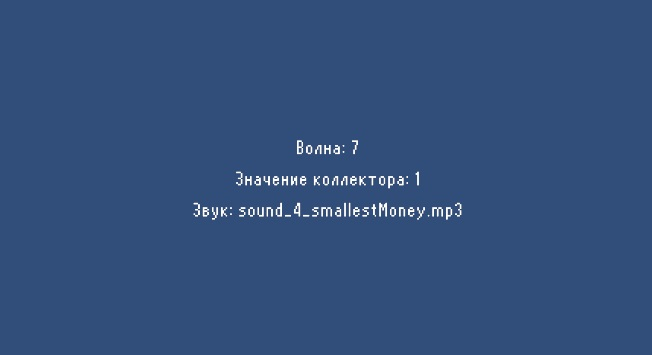

# АНАЛИЗ ДАННЫХ И ИСКУССТВЕННЫЙ ИНТЕЛЛЕКТ [AD in GameDev]
Отчет по *Лабораторной работе №2* выполнил:
- Крюков Никита Андреевич
- РИ-230915 (AT-01)

| Задание | Выполнение | Баллы |
| ------ | ------ | ------ |
| Задание 1 | * | ? |
| Задание 2 | * | ? |
| Задание 3 | * | ? | 

Работу проверили:
- к.т.н., доцент Денисов Д.В.
- к.э.н., доцент Панов М.А.
- ст. преп., Фадеев В.О.

## Цель работы
Научиться передавать в Unity данные из Google Sheets с помощью Python.

## Задание 1
*Выберите одну из игровых переменных в игре [СПАСТИ-РТФ: Выживание](https://yandex.ru/games/app/228646?lang=ru): (HP, SP, игровая валюта, здоровье и т.д.), опишите её роль в игре, условия изменения/появления и диапазон допустимых значений. Постройте схему экономической модели в игре и укажите место выбранного ресурса в ней.*

### Монеты 
Рассмотрим основную игровую переменную - монеты. Монеты в игре [СПАСТИ-РТФ: Выживание](https://yandex.ru/games/app/228646?lang=ru): выполняют роль игровой валюты. Они используются для покупки различных ресурсов, таких как патроны и оружие. Монеты являются ключевым элементом экономической модели игры, так как они позволяют игрокам улучшать свои возможности.

#### Условия изменения и появления монет
- **За просмотр рекламы:** игроки могут получать монеты за просмотр рекламы.
- **За убийство зомби:** 1 монета за убийство зомби на первой волне, 2 монеты за убийство зомби на второй волне, 3 монеты за убийство зомби на третьей волне и за убийство босса в конце волны и так далее. Количество монет, получаемых за убийство зомби, равно номеру волны, на которой находится игрок.
- **Улучшение "Коллектор":** коллектор даёт дополнительные монеты за убийство зомби и выстрелы. По моему игровому опыту, на 7 волне можно получать до 10 монет за убийство одного зомби (по моим наблюдениям). Получается, что коллектор случайно даёт от 1 до 3 монет за выстрел.

#### Диапазон допустимых значений монет
Диапазон допустимых значений для монет скорее всего не ограничен, так как игроки могут накапливать их в течение игры. Однако, количество монет, получаемых за убийство зомби, ограничено номером волны и улучшением "Коллектор".

### Схема экономической модели игры

## Задание 2
*С помощью скрипта на языке Python заполните google-таблицу данными, описывающими выбранную игровую переменную в игре “СПАСТИ РТФ:Выживание”. Средствами google-sheets визуализируйте данные в google-таблице (постройте график / диаграмму и пр.) для наглядного представления выбранной игровой величины. Опишите характер изменения этой величины, опишите недостатки в реализации этой величины (например, в игре может произойти условие наступления эксплойта) и предложите до 3-х вариантов модификации условий работы с переменной, чтобы сделать игровой опыт лучше.*

#### Описание характера изменения величины
Исходя из личных наблюдений, количество монет, получаемых за убийство зомби, линейно увеличивается с каждой волной. На первой волне игрок получает 1 монету за зомби, на второй — 2 монеты, и так далее. Улучшение "Коллектор" добавляет случайное количество монет (от 1 до 3) за выстрел, что увеличивает общее количество монет, получаемых за убийство зомби.

#### Ход работы:
- Попробуем пронаблюдать динамику на примере 7 волны. Предположим, что на ней нужно нейтрализовать 20 зомби, также будем учитывать прикаченный коллектор на несколько уровней. Создадим скрипт на Python в блокноте [code_file_1.ipynb](https://github.com/ytkinroman/urfu_2/jupyter_project/code_file_1.ipynb), который будет генерировать таблицу у которой в первой колонке будет номер зомби, во второй постоянный бонус соответствующий номеру волны, а в третью колонку запишем случайный бонус от коллектора. **По надобности можно увеличить табличку добавив несколько волн.** Скрипт:

- По таблице посчитаем общее получение монеты с каждого зомби, сделаем диаграмму, чтобы пронаблюдать динамику. 

Исходя из полученных данных можно выявить несколько проблем:
- **Линейное увеличение монет:** скучное и предсказуемое. По мнению игроков интерес пропадает, особенно в начале и конце, когда вознаграждение становится слишком большим.
- **Случайность "Коллектора":** случайное количество монет, добавляемых Коллектором, может вызвать недовольство игроков, так как это добавляет элемент непредсказуемости.

Решение проблемы:
- **Нелинейное увеличение монет:** ввести нелинейное увеличение количества монет по волнам. Например, количество монет может увеличиваться по экспоненциальной функции, что замедлит накопление монет на поздних волнах. Стоит отметить игровой опыт, что в игре данная механика не выглядит отталкивающе. Поднимаемая проблема линейности монет компенсируется затратами патроны, для устранения увеличенного кол-ва зомби.
- **Фиксированное количество монет или процента от "Коллектора":** сделать количество монет, добавляемых Коллектором, фиксированным или зависящим от уровня улучшения, что уменьшит непредсказуемость.

## Задание 3
Настройте на сцене Unity воспроизведение звуковых файлов, описывающих динамику изменения выбранной переменной. Например, если выбрано здоровье главного персонажа вы можете выводить сообщения, связанные с его состоянием.

Ход работы:
- Создал проект, настроил сцену, импортировал в него все скрипты и звуки. Также настроил доступ к Google-sheets согласно методичке.

- Для удобства дополнительно создал простой UI интерфейс, который будет отображать значение из таблички и название соответствующего звука на экране. 

- Загрузил свои звуки и шрифт, для того, чтобы создать простой интерфейс и реализовать динамику. *Звуки разделил на четыре промежутка: Самая большая сумма денег, средняя сумма денег, маленькая сумма денег и самая маленькая сумма денег.* 

- Для удобство отредактировал скрипт, который отвечал за чтение данных из Google-sheets таблицы и воспроизведении аудио. Присвоил ему новое название: [GoogleSheetsAudioController.cs](https://github.com/ytkinroman/urfu_1/blob/main/Assets/Scripts/HelloWorld.cs), сделал рефакторинг кода, чтобы избавится от дублирование кода, также внес дополнительные переменные необходимые для отображения значений. Изменил временные промежутки, согласно выбранной динамике переменной.

- Полученный результат: 

## Выводы
**В ходе выполнения работы выполнил поставленную цель:** научился передавать в Unity данные из Google Sheets с помощью Python, также вспомнил, как работать с UI в Unity. **Некоторые переменный с API ключами пришлось удалить т.к гитхаб начал ругаться и предупреждать об опасности распространения ключей.**

Буду ждать комментариев по поводу моего отчёта, хорошего Вам дня !

